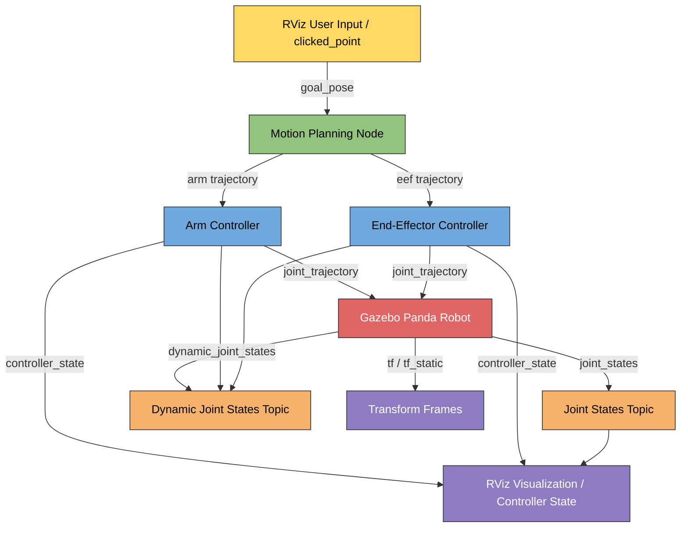

# Panda ROS 2 Simulation – Topic Data Flow & Real-Time Architecture

This repository demonstrates the **ROS 2 data flow** for the Panda robotic arm simulation. It shows how **user inputs, controllers, Gazebo, and visualization** interact through ROS 2 topics.

---

## Table of Contents

1. [Overview](#overview)  
2. [ROS 2 Topics in Simulation](#ros-2-topics-in-simulation)  
3. [Data Flow](#data-flow)  
4. [Expanded Controller & Robot Interaction](#expanded-controller--robot-interaction)  
5. [Real-Time Topic Flow Diagram](#real-time-topic-flow-diagram)  
6. [Topic Examples](#topic-examples)  
7. [TF and Pose Management](#tf-and-pose-management)  
8. [Visualization in RViz](#visualization-in-rviz)  
9. [References](#references)  

---

## Overview

The Panda robot simulation uses:  

- **Gazebo** for physics simulation  
- **MoveIt 2** for motion planning  
- **ros2_control** for hardware abstraction  

Communication between components occurs via **ROS 2 topics**, where nodes **publish** and **subscribe** to messages.

---

## ROS 2 Topics in Simulation

| Topic | Type | Description |
|-------|------|-------------|
| `/joint_states` | `sensor_msgs/JointState` | Current joint angles of the robot |
| `/dynamic_joint_states` | `sensor_msgs/JointState` | Updated joint states from controllers |
| `/arm_controller/joint_trajectory` | `trajectory_msgs/JointTrajectory` | Trajectory commands for arm controller |
| `/arm_controller/controller_state` | `controller_manager_msgs/ControllerState` | State of arm controller |
| `/eef_controller/joint_trajectory` | `trajectory_msgs/JointTrajectory` | Trajectory commands for end-effector |
| `/eef_controller/controller_state` | `controller_manager_msgs/ControllerState` | State of end-effector controller |
| `/goal_pose` | `geometry_msgs/PoseStamped` | Target pose for motion planning |
| `/clicked_point` | `geometry_msgs/PointStamped` | RViz user-selected point |
| `/tf` | `tf2_msgs/TFMessage` | Transformation frames for robot links |
| `/robot_description` | `std_msgs/String` | URDF of the robot |
| `/parameter_events` | `rcl_interfaces/msg/ParameterEvent` | Parameter updates |
| `/performance_metrics` | Custom | Controller performance monitoring |

---

## Data Flow

1. **User Input**: Clicked points in RViz → `/clicked_point`.  
2. **Planner Node**: Converts points to `/goal_pose`.  
3. **Controllers**: `/arm_controller` & `/eef_controller` receive trajectories (`/joint_trajectory`).  
4. **Robot Simulation**: Gazebo executes joint movements.  
5. **Feedback Loop**: `/joint_states` → `joint_state_broadcaster` → `/dynamic_joint_states`.  
6. **Visualization**: RViz subscribes to `/joint_states`, `/tf`, and `/controller_state`.

---

## Expanded Controller & Robot Interactionsss

